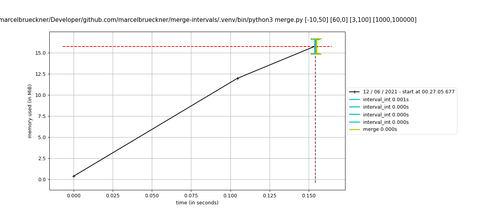
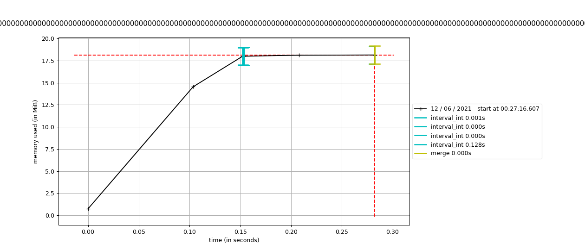

# Merge intervals

A demo project which takes a space-separated list of possibly overlapping intervals and transforms it into a list of non-overlapping intervals.

* **Example input:** `1,3 5,6 3,9 13,20`
* **Example output:** `1,9 13,20`

## Prerequisites

You will need a Python 3 (virtual) environment and some package dependencies installed.

```bash
$ python3 -m venv .venv
$ source .venv/bin/activate
$ pip install -U pip
$ pip install -r requirements.txt
```

Alternatively, run `make venv` or `make venv-dev` to set up your virtual environment.

## Usage

The main program is called `merge.py` and is simply fed with a list of intervals as arguments.
Each interval consists of a start and end value, separated via comma `,`.

```bash
$ python merge.py -h
usage: merge.py [-h] interval [interval ...]

Merge probably overlapping intervals into non-overlapping intervals.

positional arguments:
  interval    list of intervals to merge (example: -1,3 3,9)

optional arguments:
  -h, --help  show this help message and exit
```

Intervals may be wrapped in brackets (depending on your `$SHELL`, quotes might be required, too).

```bash
$ python merge.py "[1,3]" "[5,6]" "[3,9]" "[13,20]"
```

Execute `make run` to run the application with example data.

## Why Python?

It's perfectly suited for implementing quick prototype applications. Python has a simple syntax and thus is simple to read and write. That might also be reason why it's the [third most popular language](https://insights.stackoverflow.com/survey/2020#technology-most-loved-dreaded-and-wanted-languages-loved) in 2020.

## Performance

Python isn't known to lead performance comparisons between programming languages. But sometimes speed isn't the most critical requirement in a project.
You rather want to benefit from Python's ease of use and big supportive community than saving that additional `0.01s` runtime.

### Time

That said, the performance of this code isn't too bad on my 10+ years old machine.

```bash
$ time python merge.py "[1,3]" "[5,6]" "[3,9]" "[13,20]"
python merge.py "[1,3]" "[5,6]" "[3,9]" "[13,20]"  0,15s user 0,18s system 111% cpu 0,297 total
```

Additionally, Python delivers robustness out of the box. It will happily work with intervals as big as `[-10^100.000,10^100.000]` or even bigger (given you type it out, as the current code doesn't accept exponents as parameters on the command-line). However, working with big integers *slightly* impacts performance.

```bash
# Performance with small integer intervals
declare -a intervals_smallint=($(python -c 'print(f"[-10,50] [60,0] [3,100] [1000,100000]")'))
for i in {1..5}; do
   time python merge.py ${intervals_smallint[@]}
done

# Output
real    0m0.076s
user    0m0.056s
sys     0m0.015s

real    0m0.068s
user    0m0.052s
sys     0m0.013s

real    0m0.072s
user    0m0.055s
sys     0m0.014s

real    0m0.063s
user    0m0.049s
sys     0m0.012s

real    0m0.065s
user    0m0.049s
sys     0m0.013s

# Performance with big integer intervals
declare -a intervals_bigint=($(python -c 'print(f"[{-10**100},{-10**50}] [{-10**60},0] [3,{10**100}] [{10**1000},{10**100000}]")'))
for i in {1..5}; do
   time python merge.py ${intervals_bigint[@]}
done

# Output
real    0m1.762s
user    0m1.388s
sys     0m0.091s

real    0m1.371s
user    0m1.270s
sys     0m0.070s

real    0m1.336s
user    0m1.243s
sys     0m0.066s

real    0m1.351s
user    0m1.246s
sys     0m0.070s

real    0m1.226s
user    0m1.152s
sys     0m0.061s
```

### Memory

Baiscally the same applies to memory usage. For very big inputs the memory usage increases.

```bash
# Memory usage with small integer intervals
declare -a intervals_smallint=($(python -c 'print(f"[-10,50] [60,0] [3,100] [1000,100000]")'))
# Requires pip install memory-profiler
mprof run merge.py ${intervals_smallint[@]}

# Output
MEM 0.378906 1623450191.6025
MEM 11.574219 1623450191.7072


# Memory usage with big integer intervals
declare -a intervals_bigint=($(python -c 'print(f"[{-10**100},{-10**50}] [{-10**60},0] [3,{10**100}] [{10**1000},{10**100000}]")'))
# Requires pip install memory-profiler
mprof run merge.py ${intervals_bigint[@]}

# Output
MEM 0.746094 1623450393.9437
MEM 13.980469 1623450394.0472
MEM 15.968750 1623450394.1475
MEM 18.582031 1623450394.2479
MEM 18.527344 1623450394.3482
MEM 18.527344 1623450394.4514
```




## License

MIT
